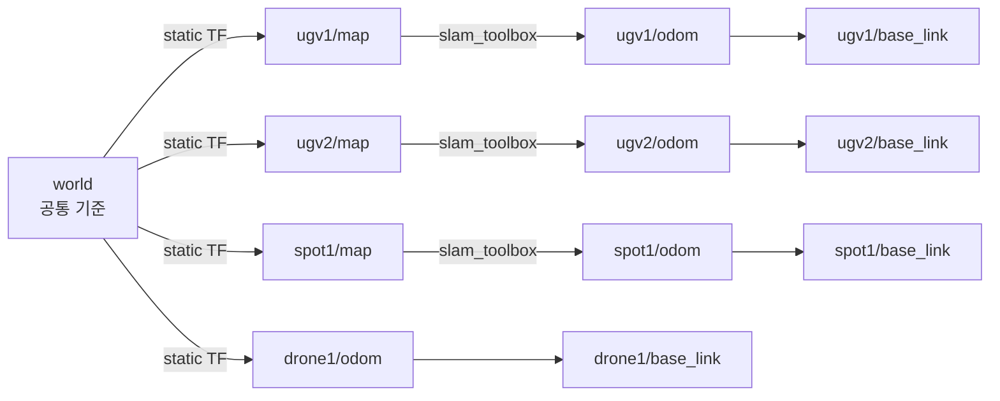
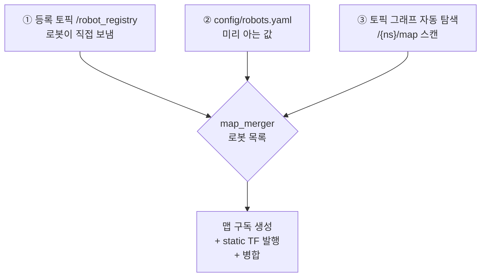

# 다중 로봇 맵 병합 구축 기록

로봇마다 따로 만들던 SLAM 맵을 **마스터 관제 컨테이너에서 하나의 전역 맵으로 합치고**,
새 로봇이 나중에 추가돼도 마스터를 건드리지 않고 자동으로 합류시키기까지의 전 과정 기록.

빠른 사용법은 [8장](#8-사용법)에 있고, 이 문서는 **왜 그렇게 만들었는지**와
**어떻게 검증했는지**를 다룬다.

- 결과 토픽: **`/map_merged`** (`nav_msgs/msg/OccupancyGrid`, frame = `world`)
- 담당 패키지: [src/webots_map_merge/](src/webots_map_merge/)

## 목차
- [전체 구조 한눈에 보기](#전체-구조-한눈에-보기)
- [1. 문제 정의](#1-문제-정의)
- [2. 정렬 설계 — `world` 앵커 프레임](#2-정렬-설계--world-앵커-프레임)
- [3. 왜 오픈소스 대신 직접 짰나](#3-왜-오픈소스-대신-직접-짰나)
- [4. 병합 알고리즘](#4-병합-알고리즘)
- [5. 로봇을 동적으로 받는 구조](#5-로봇을-동적으로-받는-구조)
- [6. 관제 화면 (RViz)](#6-관제-화면-rviz)
- [7. 인터페이스 규격](#7-인터페이스-규격)
- [8. 사용법](#8-사용법)
- [9. 검증 방법과 결과](#9-검증-방법과-결과)
- [10. 해결된 이슈 (트러블슈팅 기록)](#10-해결된-이슈-트러블슈팅-기록)
- [11. 알려진 한계 / 다음 작업](#11-알려진-한계--다음-작업)
- [12. 파일 맵](#12-파일-맵)

---

## 전체 구조 한눈에 보기

```
[각 로봇 컨테이너]                          [마스터 관제 컨테이너]

ugv1_brain_windows                          rviz_master_windows
  ├─ webots_ros2_driver                       │
  │    └─ odom→base_link (GPS 절대좌표)       ├─ map_merger
  ├─ slam_toolbox                             │    ├─ 로봇 발견 (3경로)
  │    └─ /ugv1/map  ────────────────────────→│    ├─ world→{ns}/map static TF
  │       ugv1/map→ugv1/odom                  │    └─ /map_merged  ──┐
  ├─ robot_state_publisher                    │                      │
  │    └─ /ugv1/robot_description ───────────→├─ joint_state_filler  │
  ├─ nav2                                     │    └─ 누락 관절 0으로 채움
  └─ robot_registrar                          │                      │
       └─ /robot_registry ───────────────────→├─ robot_marker_publisher
          (1Hz 하트비트)                       │    └─ /robot_markers ─┤
                                              │                      │
ugv2 / spot1 / drone1 도 동일 구조             └─ rviz2 ←─────────────┘
```

세 노드 전부 **마스터에서 돌고, 로봇을 스스로 찾아낸다.** 로봇이 늘어나도
마스터 설정을 고치거나 재시작할 필요가 없다는 것이 이 구조의 핵심 목표다.

로봇 쪽에 들어가는 것은 `robot_registrar` 하나뿐이고, 그것마저 없어도
(spot1처럼) 자동 탐색으로 병합에 참여한다.

---

## 1. 문제 정의

이 프로젝트는 로봇마다 slam_toolbox가 **자기만의 맵과 자기만의 좌표계**를 만든다
([Readme 7절](Readme.md#7-로봇-위치-및-맵-데이터)).

| 로봇 | 맵 토픽 | 맵 프레임 | SLAM |
|---|---|---|---|
| ugv1 | `/ugv1/map` | `ugv1/map` | ✅ |
| ugv2 | `/ugv2/map` | `ugv2/map` | ✅ |
| spot1 | `/spot1/map` | `spot1/map` | ✅ |
| drone1 | — | — | ❌ 거리 센서 없음 |

문제는 **`ugv1/map`의 (0,0)과 `ugv2/map`의 (0,0)이 월드에서 서로 다른 지점**이라는 것이다.
그래서 병합 전에는:

- 관제 화면에서 "전체 현장이 어떻게 생겼는지"를 한 번에 볼 수 없다
- ugv1이 발견한 장애물을 ugv2가 알 방법이 없다
- 웹에서 지도를 클릭할 때 "지금 어느 로봇의 지도를 보고 있는지"를 항상 따져야 한다

맵 병합은 이 세 가지를 한 번에 푼다.

---

## 2. 정렬 설계 — `world` 앵커 프레임

### 접근

로봇 맵끼리 직접 겹치려 하지 않는다. 대신 **공통 기준 프레임 `world`를 하나 세우고,
각 로봇 맵을 거기에 못 박는다.**



`world → {ns}/map` 변환만 알면 병합은 **좌표 변환 + 리샘플링이라는 순수 계산 문제**로 줄어든다.
맵이 없는 로봇(드론)은 `{ns}/map` 대신 `{ns}/odom`을 매달아 위치만 관제 화면에 올린다.

얻는 것:

- RViz에서 Fixed Frame을 `world`로 두면 **모든 로봇이 한 화면에** 제 위치로 나온다
- 로봇 간 좌표 변환이 tf2로 공짜가 된다 (`ugv1/map`의 점 → `world` → `ugv2/map`)
- 웹 목표점도 나중에 `world` 기준 하나로 통일할 수 있다

### 이 프로젝트에서 그 변환은 **항등변환(0,0,0)** 이다

> 처음에는 "`{ns}/map`의 원점 = 그 로봇의 스폰 위치"라고 보고 스폰 좌표를 앵커로 넣었다.
> **실제 시뮬에서 돌려보니 틀렸고, 좌표가 정확히 두 배로 어긋났다.**

원인은 Webots 드라이버에 있다.
[robot_driver.py:163-165](src/Webots-SummitXL/workspace/simulator/simulator/robot_driver.py#L163-L165)가
`odom → base_link`를 **GPS 원값 그대로** 넣는다.

```python
t.transform.translation.x = float(gps_vals[0])   # Webots 월드 절대 X
```

Webots GPS는 월드 절대좌표를 준다. 따라서 **각 로봇의 `odom` 프레임 원점이 이미 Webots 월드 원점**이고,
그 위에 얹히는 `{ns}/map`도 (SLAM이 `map→odom`을 거의 항등으로 두므로) 이미 world와 정렬돼 있다.
여기에 스폰 좌표를 또 더하면 offset이 두 번 들어간다.

실측 대조 — SLAM이 주는 값이 이미 월드 좌표다:

| | `{ns}/map → base_link` (SLAM 값) | Webots 스폰 좌표 |
|---|---|---|
| ugv1 | (-5.84, +1.51) | (-6.16, +1.26) |
| ugv2 | (+8.00, +1.23) | (+8.38, +1.37) |
| spot1 | (-0.77, -0.34) | (-0.84, -0.34) |

그래서 `robots.yaml`의 **`odom_is_world_absolute: true`**가 기본이고,
이때 `world → {ns}/map`은 항등변환이 된다.

이건 오히려 더 좋은 상황이다. 스폰 좌표에 의존하지 않으므로 **초기 정렬 오차도,
초기 추정값에서 출발하는 드리프트 문제도 시뮬레이션 안에서는 아예 없다.**

`odom_is_world_absolute: false`로 두면 원래 설계대로 스폰 좌표를 앵커로 쓴다.
오도메트리가 로봇 자기 출발점 기준인 **실제 로봇**으로 넘어갈 때 그 경로가 필요하며,
기하 단위 테스트로 그 경로도 함께 검증해두었다([9-1절](#9-1-기하-단위-검증-가짜-맵)).

---

## 3. 왜 오픈소스 대신 직접 짰나

가장 유명한 선택지는 **`multirobot_map_merge`**
(ROS 2 포크: [robo-friends/m-explore-ros2](https://github.com/robo-friends/m-explore-ros2))다.
안 쓴 이유는 하나다.

> 이 패키지의 핵심 가치는 **초기 위치를 모를 때** OpenCV 특징점 매칭(ORB/AKAZE)으로
> 맵끼리 겹쳐 맞춰주는 기능인데, 우리는 Webots 시뮬이라 좌표 기준을 이미 알고 있다.

즉 이미 풀려 있는 문제를 비싸고 불확실한 방법으로 다시 푸는 셈이다.
게다가 그 패키지의 `known_init_poses` 경로는 ROS 2 포크에서 검증이 덜 된 편이라
파라미터 맞추는 삽질 비용이 직접 짜는 비용보다 컸다.

직접 짠 병합 로직의 실질 코드량은 **40줄 남짓**이다
([map_merger.py](src/webots_map_merge/webots_map_merge/map_merger.py)).

검토한 다른 후보들:

| 후보 | 판단 |
|---|---|
| `multirobot_map_merge` | 특징점 매칭이 불필요. 나중에 **보정용**으로 얹을 여지는 있음 |
| `map_merge_3d` | 포인트클라우드용. 2D 격자만 다루는 지금은 오버킬 |
| [Swarm-SLAM / cslam](https://github.com/lajoiepy/cslam) | 로봇 간 loop closure까지 하는 "제대로 된" 방식. 셋업 비용이 큼 → [11장](#11-알려진-한계--다음-작업) |
| `grid_map` (ANYbotics) | 머저가 아니라 다층 격자 라이브러리. 기반으로만 쓸 것 |

---

## 4. 병합 알고리즘

### 4-1. 경계상자 잡기

활성 로봇들의 맵 네 귀퉁이를 `world`로 변환해 전체를 감싸는 축정렬 사각형을 구하고,
가장자리에 `padding`(기본 1 m)을 준다. 이게 병합 격자의 크기가 된다.

로봇이 늘거나 맵이 자라면 이 사각형도 매 주기 자동으로 커진다. **고정 크기 맵이 아니다.**

초기 위치를 잘못 넣으면 격자가 폭주할 수 있어 `max_merged_cells`(기본 800만) 안전장치를 뒀다.
넘으면 그 주기를 건너뛰고 에러를 남긴다.

### 4-2. 역방향 매핑으로 샘플링

**병합 격자의 각 셀에서 출발해 "이 위치가 원본 맵의 어느 셀인가"를 거꾸로 찾는다.**

```python
c, s = cos(-theta), sin(-theta)          # theta = 앵커 yaw + 맵 origin yaw
gx = c*(world_x - tx) - s*(world_y - ty) # world -> 격자 로컬 좌표
gy = s*(world_x - tx) + c*(world_y - ty)
col = floor(gx / info.resolution); row = floor(gy / info.resolution)
```

정방향(원본 셀 → 병합 셀)으로 하면 회전·해상도 차이 때문에 **격자에 구멍이 뚫린다.**
역방향은 모든 병합 셀이 반드시 값을 하나 갖게 되므로 그런 문제가 없다.

전부 numpy 벡터 연산이라 40 m × 40 m / 0.1 m 해상도(= 16만 셀) × 로봇 4대라도 한 주기가 수십 ms다.

### 4-3. 겹치기 규칙은 `max` 하나

점유 격자 값이 **`-1`(미탐색) < `0`(비어있음) < `100`(장애물)** 순서라서,
크기 비교가 그대로 우선순위가 된다.

```python
np.maximum(merged, sampled, out=merged)
```

- 한 로봇이 미탐색이고 다른 로봇이 봤으면 → **본 쪽을 채택**
- 한 로봇이 비었다고 하고 다른 로봇이 장애물이라 하면 → **장애물 채택** (안전한 쪽)

> 로봇들이 같은 공간을 겹쳐 매핑하므로 **병합 결과가 개별 맵의 단순 합보다 작은 것이 정상이다.**
> 검증할 때는 "합계"가 아니라 "가장 큰 개별 맵보다 넓은가"를 봐야 한다.

---

## 5. 로봇을 동적으로 받는 구조

"계속 추가되는 로봇을 어떻게 받을 것인가"에 대한 답. **세 경로를 겹쳐서** 쓴다.
하나만 쓰면 각각 구멍이 있기 때문이다.



| 경로 | 알 수 있는 것 | 우선순위 | 한계 |
|---|---|---|---|
| ① **등록 토픽** | 존재 + **생존 여부** + 초기 위치 | 가장 높음 | 로봇 쪽에 `robot_registrar`를 띄워야 함 |
| ② **설정 파일** | 존재 + 초기 위치 | 중간 | 새 로봇마다 마스터 설정을 고쳐야 함 |
| ③ **자동 탐색** | 존재만 | 가장 낮음 | 생존 판단을 맵 수신 시각에만 의존 |

> `odom_is_world_absolute: true`(현재 기본)에서는 초기 위치 값이 쓰이지 않는다.
> 세 경로 모두 실질적으로 **"누가 살아 있는가"**를 알아내는 용도다.
> 그중 ①이 가장 중요한데, 하트비트가 있어야 로봇이 사라진 걸 빠르고 정확히 알 수 있기 때문이다.

### ① 등록 토픽 — 진짜 "동적"인 부분

로봇 컨테이너가 뜨면 `robot_registrar`가 1 Hz로 이런 JSON을 흘린다.

```json
{"robot_id": "ugv3", "init_x": -2.0, "init_y": 4.5, "init_yaw": 1.57,
 "has_map": true, "map_topic": "/ugv3/map"}
```

- QoS가 `TRANSIENT_LOCAL`이라 **마스터가 나중에 떠도 이미 보낸 명함을 받는다.**
  컨테이너 기동 순서를 신경 쓸 필요가 없다.
- 같은 내용을 반복 발행하는 것이 **하트비트** 역할을 한다.
  마스터는 `robot_timeout`(기본 15초) 동안 소식이 없으면 그 로봇을 병합에서 뺀다.
  → 컨테이너를 내렸는데 유령 맵이 화면에 남아 있는 일이 없다.
- 초기 위치는 `docker-compose.yml`의 `ROBOT_INIT_X/Y/YAW` 환경변수에서 읽는다.
  기존에 `ROBOT_ID`를 주입하던 방식과 같은 결이다.

### ③ 자동 탐색 — 안전망

마스터가 0.5 Hz로 ROS 토픽 그래프를 훑어 `/{무언가}/map` 패턴 + `OccupancyGrid` 타입을 찾는다.

```python
for topic, types in self.get_topic_names_and_types():
    if 'nav_msgs/msg/OccupancyGrid' not in types:
        continue
    match = self.map_topic_regex.fullmatch(topic)   # ^/([^/]+)/map$
```

`robot_registrar`를 안 붙인 로봇도 **존재가 인지되고 병합에 정상 참여**한다.
실제로 spot1은 registrar 없이 이 경로만으로 병합되고 있다
(런치 파일이 서브모듈에 있어 손대지 않았다 → [10장 ⑦](#-spot1은-등록-노드-없이-자동-탐색으로만-참여한다)).

### 시각 기준은 전부 시뮬 시간

생존 판정, 병합 주기, 마커 갱신 모두 노드 클럭(`use_sim_time: true`)을 쓴다.
**Webots를 일시정지하면 병합도 같이 멈추고, 멈춘 동안 로봇이 죽은 것으로 오판하지도 않는다.**
의도한 동작이다.

---

## 6. 관제 화면 (RViz)

### RViz2는 디스플레이를 자동 추가하지 못한다

설정 파일을 읽는 시점에 고정되므로, 로봇당 하나씩 필요한 `RobotModel` 같은 디스플레이는
새 로봇이 생겨도 저절로 안 생긴다.
Humble의 TF 디스플레이에는 whitelist 필터도 없어서 프레임을 패턴으로 걸러낼 수도 없다
(`rviz_default_plugins` 11.2.27에서 확인).

그래서 **"하나의 디스플레이가 여러 대상을 그리는" 방식**으로 우회한다.
`robot_marker_publisher`가 TF 트리에서 `{ns}/base_link` 형태의 프레임을 전부 찾아
각 로봇 위치에 **화살표(방향) + 이름표** 마커를 만들고 `/robot_markers` 하나로 발행한다.
RViz에는 MarkerArray 디스플레이 **하나만** 있으면 되고, 로봇이 늘어나도 설정을 안 고쳐도 된다.

발견 기준을 TF로 잡은 이유는, 맵이 없는 로봇(드론)이나 등록 노드를 안 띄운 로봇(spot1)도
`world`에 연결만 되어 있으면 전부 잡히기 때문이다.

### 자동으로 되는 것과 안 되는 것

| | 자동 | 수동 |
|---|---|---|
| 위치·방향·이름 | ✅ 마커 | |
| 병합 맵 기여 | ✅ | |
| 3D 메시 모델 | | RobotModel 디스플레이 추가 (Description Topic = `/{ns}/robot_description`, **TF Prefix = `{ns}`**) |

즉 **새 로봇은 아무것도 안 해도 위치와 이름이 뜨고**, 3D 모델까지 보고 싶을 때만
디스플레이를 하나 추가하면 된다.

### 기본 설정에 들어 있는 디스플레이

[master_merged.rviz](src/webots_map_merge/rviz/master_merged.rviz) — master 컨테이너가 자동으로 띄운다.

| 표시 이름 | 내용 | 새 로봇 자동 반영 |
|---|---|---|
| **Merged Map** | `/map_merged` 전체 병합 맵 | ✅ |
| **Robots (auto)** | `/robot_markers` — 화살표 + 이름표 | ✅ |
| **Robot Poses (TF)** | 각 로봇 `base_link` 축 + 이름표 | ❌ 프레임을 하나씩 지정 |
| **{ns} model** | 각 로봇 3D 모델 | ❌ 로봇당 디스플레이 1개 |
| ugv1/ugv2 scan | 기본 꺼짐 | ❌ |

Fixed Frame은 `world`, 기본 시점은 위에서 내려다보는 TopDownOrtho다.
Views 패널에서 **Angled View**를 고르면 3D로 볼 수 있다.

> **표시 이름은 반드시 영어로 쓸 것.** 컨테이너(`osrf/ros:humble-desktop`)에 한글 폰트가
> 없어서 RViz 패널의 한글이 전부 네모(□□)로 깨진다. 터미널 로그는 UTF-8로 정상 출력되므로
> 노드의 한글 로그는 그대로 둬도 된다.

> 예전 `webots_python/rviz/webots_rviz.rviz`는 ugv1 단독 뷰(Fixed Frame이 `map`)라
> 지금 구조와 맞지 않는다. 그대로 두었으니 개별 로봇을 볼 때만 쓰면 된다.

---

## 7. 인터페이스 규격

### 토픽

| 토픽 | 타입 | 방향 | QoS | 비고 |
|---|---|---|---|---|
| `/map_merged` | `nav_msgs/OccupancyGrid` | 마스터 발행 | Reliable, **Transient Local**, depth 1 | frame = `world` |
| `/robot_markers` | `visualization_msgs/MarkerArray` | 마스터 발행 | Reliable, Volatile, depth 10 | 로봇당 화살표 + 이름표 |
| `/robot_registry` | `std_msgs/String` (JSON) | 로봇 → 마스터 | Reliable, **Transient Local**, depth 20 | 명함 + 1 Hz 하트비트 |
| `/{ns}/map` | `nav_msgs/OccupancyGrid` | 로봇 → 마스터 | Reliable, **Transient Local**, depth 1 | slam_toolbox 발행 |
| `/{ns}/robot_description` | `std_msgs/String` | 로봇 → 마스터 | Reliable, **Transient Local** | URDF |
| `/{ns}/joint_states` | `sensor_msgs/JointState` | 양방향 | 기본 | 마스터가 누락분만 보충 발행 |

> **QoS가 안 맞으면 에러도 경고도 없이 아무것도 안 들어온다.** `Transient Local` 표시된
> 토픽을 직접 구독·디버깅할 때는 반드시 맞춰야 한다 → [10장 ①](#-map_merged가-아예-안-나온다)

### 프레임

| 프레임 | 부모 | 발행 주체 |
|---|---|---|
| `world` | (최상위) | — |
| `{ns}/map` | `world` | **map_merger** (static, 맵 있는 로봇) |
| `{ns}/odom` | `{ns}/map` 또는 `world` | slam_toolbox / **map_merger** (맵 없는 로봇) |
| `{ns}/base_link` | `{ns}/odom` | 로봇 드라이버 |

### 파라미터 — `map_merger`

[config/robots.yaml](src/webots_map_merge/config/robots.yaml)

| 파라미터 | 기본값 | 의미 |
|---|---|---|
| `world_frame` | `world` | 공통 기준 프레임 |
| `merged_map_topic` | `/map_merged` | 병합 결과 토픽 |
| `resolution` | `0.1` | 병합 격자 해상도(m). 로봇 SLAM과 맞추는 게 깔끔 |
| `merge_rate` | `1.0` | 병합 발행 주기(Hz) |
| `discovery_rate` | `0.5` | 새 로봇 탐색 주기(Hz) |
| `robot_timeout` | `15.0` | 이 시간(초) 무응답이면 병합에서 제외 |
| `padding` | `1.0` | 병합 격자 가장자리 여유(m) |
| `max_merged_cells` | `8000000` | 격자 폭주 방지 안전장치 |
| `auto_discovery` | `true` | 토픽 그래프 자동 탐색 사용 여부 |
| `publish_static_tf` | `true` | `world→{ns}/map` static TF 발행 여부 |
| **`odom_is_world_absolute`** | **`true`** | **가장 중요.** `true`면 앵커가 항등변환 → [2장](#2-정렬-설계--world-앵커-프레임) |
| `map_topic_pattern` | `^/([^/]+)/map$` | 자동 탐색 정규식 |
| `registry_topic` | `/robot_registry` | 등록 토픽 이름 |
| `robots.{ns}.init_x/y/yaw` | — | 스폰 좌표. `odom_is_world_absolute: false`일 때만 사용 |
| `robots.{ns}.has_map` | `true` | `false`면 맵 구독 안 함 (드론) |

### 파라미터 — 보조 노드

| 노드 | 파라미터 | 기본값 | 의미 |
|---|---|---|---|
| `joint_state_filler` | `settle_time` | `8.0` | 이 시간(초) 뒤 누락 관절을 **한 번만** 판단하고 고정 |
| | `publish_rate` | `2.0` | 채움 발행 주기(Hz) |
| | `discovery_rate` | `0.5` | 로봇 탐색 주기(Hz) |
| `robot_marker_publisher` | `max_pose_age` | `5.0` | TF가 이보다 오래되면(또는 미래면) 로봇 제외 |
| | `publish_rate` | `2.0` | 마커 발행 주기(Hz) |
| | `arrow_length` / `text_size` | `1.0` / `0.5` | 마커 크기(m) |
| `robot_registrar` | `robot_id` | `$ROBOT_ID` | 로봇 이름 |
| | `init_x/y/yaw` | `$ROBOT_INIT_*` | 스폰 좌표 |
| | `has_map` | `true` | 맵 생성 여부 |
| | `publish_rate` | `1.0` | 하트비트 주기(Hz) |

---

## 8. 사용법

### 실행

기존과 동일하다. 마스터 컨테이너의 실행 명령만 바뀌었다.

```bash
docker compose -f docker-configs/windows/docker-compose.yml up --build -d
```

<details>
<summary>바뀐 부분 (docker-compose.yml)</summary>

```yaml
  master:
    command: >
      bash -c "source /ros2_ws/install/setup.bash &&
               ros2 launch webots_map_merge master.launch.py"   # rviz2 단독 실행에서 변경

  ugv1:
    environment:
      - ROBOT_ID=ugv1
      - ROBOT_INIT_X=-6.159     # 🆕 추가 (현재는 미사용, 실제 로봇 대비)
      - ROBOT_INIT_Y=1.263
      - ROBOT_INIT_YAW=-2.910
```
</details>

헤드리스로 돌리려면:

```bash
ros2 launch webots_map_merge master.launch.py use_rviz:=false
```

### 새 로봇 추가 절차

`ugv3`을 추가한다고 하면:

1. **Webots**: `my_world.wbt`에서 SummitXlSteel 복사 → name을 `ugv3`으로 변경
   ([Readme 4절](Readme.md#4-로봇-추가-방법-향후-자동화-예정))
2. **docker-compose.yml**에 서비스 추가 — `ugv1` 블록을 복사해서 이름만 바꾸면 끝

```yaml
  ugv3:
    <<: *ros-common
    container_name: ugv3_brain_windows
    environment:
      - DISPLAY=${DISPLAY:-host.docker.internal:0}
      - RMW_IMPLEMENTATION=rmw_fastrtps_cpp
      - ROS_LOCALHOST_ONLY=0
      - ROS_DOMAIN_ID=30
      - ROBOT_ID=ugv3
      - ROBOT_INIT_X=-2.0
      - ROBOT_INIT_Y=4.5
      - ROBOT_INIT_YAW=1.5708
    command: >
      bash -c "source /ros2_ws/install/setup.bash &&
               ros2 launch webots_python single_ugv.launch.py"
    depends_on:
      - master
```

3. `docker compose up -d ugv3`

**마스터는 건드리지 않는다.** 몇 초 안에 `[등록] 새 로봇 합류: ugv3`이 찍히고
병합 맵이 넓어지며 RViz에 마커가 뜬다. 재시작도 필요 없다
([9-3절](#9-3-동적-합류이탈-검증)에서 실측).

> 🚨 새 로봇을 월드에 추가했으면 **그 컨테이너를 반드시 띄워야 한다.**
> `<extern>` 컨트롤러가 하나라도 안 붙으면 시뮬레이션 전체가 멈춘다
> → [10장 ②](#-로봇-컨테이너를-전부-띄워야-시뮬이-돈다)

> `ROBOT_INIT_*`은 현재 기본 설정에서 **쓰이지 않는다.** 실제 로봇 전환을 위해
> 기록해두는 값이므로 채워두면 좋지만, 없어도 병합은 된다.

### 런타임 소환(`webots_robot_spawner`)과의 관계 — 작업 중

위 절차는 **컨테이너를 미리 정의해두는 방식**이다. 이와 별개로 실행 중인 Webots에
로봇을 바로 추가하는 소환기(`fleet` 서비스)가 개발 중이다.

```bash
ros2 service call /spawn_robot webots_spawner_msgs/srv/SpawnRobot "{type: 'drone', random: true}"
```

**맵 병합 쪽은 이걸 위해 고칠 것이 없다.** 소환기가 로봇의 뇌를 띄울 때
`ROBOT_ID` / `ROBOT_INIT_*` 환경 변수를 넣어 주므로 기존 런치 경로를 그대로 타고,
그러면 `robot_registrar`가 돌아 [5장](#5-로봇을-동적으로-받는-구조)의 ① 경로로 합류한다.
등록 노드가 없더라도 ③ 자동 탐색과 TF 기반 마커가 받아준다.

즉 **"미리 정의한 컨테이너"든 "런타임 소환"이든 마스터 입장에서는 똑같이 보인다.**
이게 발견 경로를 토픽·TF 기반으로 잡은 이유이기도 하다.

### yaw 값 구하기 (`odom_is_world_absolute: false`일 때만 필요)

`.wbt`의 `rotation`은 `축x 축y 축z 각도` 형식이다. 로봇이 바닥에 똑바로 서 있으면
축이 대략 `0 0 1`이므로 **마지막 각도 값이 곧 yaw**다.

```
rotation 0.00494 -0.00297 0.99998 -2.910405    ->  init_yaw = -2.910
rotation 0.1638  -0.0159  -0.98635 0.06476     ->  init_yaw = -0.064  (z가 음수 → 부호 반전)
```

### 확인 명령어

```bash
docker exec -it rviz_master_windows bash
source /ros2_ws/install/setup.bash

ros2 topic hz /clock                           # 0Hz면 시뮬이 안 돌고 있는 것 (가장 먼저 확인)
ros2 topic hz /map_merged                      # 시뮬 시간 기준 1Hz
ros2 topic echo /map_merged --field info       # 격자 크기 / 원점 / 해상도
ros2 topic echo /robot_registry                # 지금 등록된 로봇들
ros2 topic echo /robot_markers --once | grep ns:   # 마커가 잡은 로봇 목록
ros2 run tf2_ros tf2_echo world ugv1/base_link # 정렬 확인
docker logs rviz_master_windows | grep -E "등록|탐색|구독|이탈|마커|채움"
```

---

## 9. 검증 방법과 결과

기하 계산 → 실제 시뮬 → 동적 시나리오 순으로 층을 나눠 검증했다.
각 층에서 잡히는 버그의 종류가 다르기 때문이다.

### 9-1. 기하 단위 검증 (가짜 맵)

ROS 2 컨테이너 안에서 **가짜 로봇 2대의 맵을 직접 만들어 넣고 병합 결과를 셀 단위로 대조**한다.
Webots 없이 돌아가므로 좌표 변환 로직만 격리해서 볼 수 있다.

앵커 경로(`odom_is_world_absolute: false`)를 명시적으로 켜고 검사한다.

| 케이스 | 검사 | 결과 |
|---|---|---|
| 평행이동 (x+1 m) | 두 맵이 정확히 나란히 붙는가, 바깥이 미탐색(-1)인가 | ✅ 5/5 |
| 90° 회전 | 회전 변환이 맞는가 | ✅ 3/3 |

> 이 테스트를 짤 때 **첫 번째 병합 메시지에서 멈추면** 두 번째 로봇이 합류하기 전
> 스냅샷을 잡는다. 고정 시간 동안 받고 **마지막 메시지**를 검사해야 한다.

### 9-2. 실제 시뮬레이션 검증

Webots + 컨테이너 5개(master/ugv1/ugv2/spot1/drone1)를 실제로 띄워 확인.

| 검사 | 결과 |
|---|---|
| 개별 로봇 맵 수신 | ✅ 3대 (ugv1, ugv2, spot1) |
| `/map_merged` 발행 | ✅ 60초에 18회, frame_id = `world` |
| 병합 맵 내용 | ✅ 탐색 셀 22,044 / 장애물 1,037 |
| 병합이 최대 개별 맵보다 넓은가 | ✅ 개별 최대 13,041 → 병합 22,044 |
| `world → {ns}/map` static TF | ✅ 전부 존재 |
| 전 링크 TF 확보 | ✅ ugv1 28/28, ugv2 28/28, spot1 78/78, drone1 6/6 |

**정렬 정확도** — `world` 기준 로봇 실제 위치 vs Webots 스폰 좌표:

| 로봇 | world 기준 측정 | 스폰 좌표 | 오차 | (수정 전) |
|---|---|---|---|---|
| ugv1 | (-5.84, +1.51) | (-6.16, +1.26) | **0.40 m** | 6.03 m |
| ugv2 | (+8.00, +1.23) | (+8.38, +1.37) | **0.40 m** | 8.09 m |
| spot1 | (-0.76, -0.34) | (-0.84, -0.34) | **0.08 m** | 0.84 m |

남은 오차는 GPS 센서 장착 위치와 `base_link` 원점 차이, 물리 안정화 중의 미세 이동 때문이다.
**좌표계가 틀렸다면 수 m~10 m 단위로 어긋난다** — 이 검사가 정렬 버그를 잡아낸 근거다.

**바퀴 관절** — ugv1을 0.3 m/s로 1.5초 전진시킨 뒤 각도 변화를 본다.

| 관절 | 전 | 후 | Δ |
|---|---|---|---|
| front_left_wheel_joint | +2175.900 | +2176.836 | 0.936 rad |
| front_right_wheel_joint | +2220.740 | +2221.676 | 0.936 rad |
| back_left_wheel_joint | +2059.586 | +2060.522 | 0.936 rad |
| back_right_wheel_joint | +2074.730 | +2075.666 | 0.936 rad |

네 바퀴가 **같은 값**인 것이 직진에 부합한다. 크기도 맞다 — 시뮬이 실시간의 약 27%로 도므로
실제 진행 거리는 `0.3 × 1.5 × 0.27 ≈ 0.12 m`, 바퀴 반경 0.123 m로 나누면 약 0.99 rad이다.

> 값이 2000을 넘는 것은 연속 회전 관절이라 각도가 계속 누적되기 때문이다.
> TF 계산은 각도를 그대로 쓰므로 문제없다.

### 9-3. 동적 합류/이탈 검증

월드에 없는 **가상 로봇을 실제 경로 그대로 합류시켰다 뗀다.**
(등록 토픽 + `{ns}/odom → {ns}/base_link` TF만 발행하는 컨테이너)

| 시점 | 병합 격자 | 마커 | 로그 |
|---|---|---|---|
| 합류 전 | 227 × 183 | 4대 | — |
| 합류 후 | **294 × 201** | **5대** (6초 뒤) | `[등록] 새 로봇 합류` → `[구독]` → `[TF]` → `[마커] 발견` |
| 이탈 후 | 227 × 183 (복귀) | 4대 (22초 뒤) | `[이탈] 15초 동안 무응답` → `[마커] 사라짐` |

294 = 가상 로봇 맵 끝(x = 17 m) + 여유 1 m 까지 정확히 확장된 수치다.
**마스터는 재시작 없이** 합류·이탈을 모두 처리했다.

### 9-4. 빌드

`colcon build` 9개 패키지 통과, 실행 파일 4개(`map_merger`, `robot_registrar`,
`joint_state_filler`, `robot_marker_publisher`) 정상 등록.

---

## 10. 해결된 이슈 (트러블슈팅 기록)

### ① `/map_merged`가 아예 안 나온다

**1순위 — QoS 미스매치.** slam_toolbox의 `map`은 `TRANSIENT_LOCAL + RELIABLE + depth 1`로 나온다.
기본 QoS로 구독하면 **에러도 경고도 없이 그냥 아무것도 안 들어온다.**

```bash
ros2 topic echo /ugv1/map --qos-durability transient_local --qos-reliability reliable --field info
```

**2순위 — `/clock`이 안 돈다.** 병합 노드는 시뮬 시간으로 동작하므로 Webots가 멈춰 있으면
병합도 멈춘다(의도된 동작). `ros2 topic hz /clock`으로 먼저 확인할 것.

### ② 로봇 컨테이너를 전부 띄워야 시뮬이 돈다

`my_world.wbt`의 로봇 4대가 모두 `controller "<extern>"`인데,
Webots는 **동기화 모드 extern 컨트롤러가 전부 접속할 때까지 스텝을 밟지 않는다.**

`master + ugv1 + ugv2`만 띄웠을 때 실제로 관측된 증상:

- 센서 토픽은 다 보임 (드라이버는 접속됨)
- `/clock` 0 Hz, `/ugv1/scan` 0 Hz
- SLAM이 맵을 못 만들고 `ugv1/map` **프레임 자체가 안 생김**
- Nav2가 `Invalid frame ID "ugv1/map"` 무한 반복

증상만 보면 맵 병합이 고장 난 것 같지만 원인은 전혀 다른 곳이다.
**월드에 있는 로봇 수만큼 컨테이너를 다 띄우거나**, 안 쓸 로봇은 월드에서 뺀다.

> 드론 문서 5장 ⑥과 같은 현상이다. 그때는 `/drone1/gps`도 같이 멈춘 것이 단서였고,
> 여기서는 `/clock` 자체가 0 Hz인 것이 단서였다.

### ③ 좌표가 정확히 두 배로 어긋남

스폰 좌표를 앵커로 넣었는데 오도메트리가 이미 월드 절대좌표였다.
→ `odom_is_world_absolute` 도입. 자세한 내용은 [2장](#2-정렬-설계--world-앵커-프레임).

**진단 요령**: 어긋난 거리가 각 로봇의 스폰 좌표와 비슷하면 offset이 두 번 들어간 것이다.

```bash
ros2 run tf2_ros tf2_echo ugv1/map ugv1/base_link
```

- 결과가 **월드 절대좌표에 가까우면** → `odom_is_world_absolute: true` (현재 기본)
- 결과가 **(0,0) 근처에서 출발하면** → `false`로 바꾸고 초기 위치를 채운다

### ④ RViz의 RobotModel이 빨갛게 뜬다

`RobotModel`은 **URDF 링크 하나라도 TF가 없으면 통째로 빨간 에러**가 된다.
`robot_state_publisher`는 `joint_states`를 받아야 움직이는 관절의 TF를 만들기 때문에,
관절 상태가 안 오면 그 아래 링크 전체의 TF가 사라진다.

처음 진단했을 때의 누락:

| 로봇 | 움직이는 관절 | joint_states 수신 | 누락 | 원인 |
|---|---|---|---|---|
| ugv1 / ugv2 | 4 | **0** | 4 (바퀴) | 드라이버가 바퀴 모터를 구동만 하고 상태를 발행하지 않음 |
| spot1 | 25 | 16 | 9 (팔·그리퍼) | 월드의 Spot에 팔이 안 달려 있는데 URDF에는 팔이 있음 |
| drone1 | 0 | 0 | 0 | 움직이는 관절이 없어 문제 없음 |

**드론만 멀쩡했던 것이 진단의 결정적 단서였다.**

대응은 두 갈래로 갈렸다.

**UGV 바퀴 — 드라이버가 실값을 발행하도록 고쳤다 (근본 해결).**
[robot_driver.py](src/Webots-SummitXL/workspace/simulator/simulator/robot_driver.py)가
모터에서 `getPositionSensor()`로 위치 센서를 직접 얻어 `joint_states`를 발행한다.
센서 이름을 추측하지 않아도 되고, PositionSensor가 없는 모델이면 `None`이 돌아와
그 바퀴만 조용히 빠진다. **이제 화면에서 바퀴가 실제로 돈다.**

**Spot 팔 — `joint_state_filler`가 0으로 채운다 (대증요법).**
실제로 안 달린 팔이라 채울 실값 자체가 없다. URDF에서 움직이는 관절을 뽑고
`joint_states`를 지켜보다가 **한 번도 안 나타난 관절만** 0으로 발행한다.
드라이버가 실제로 발행하는 관절은 건드리지 않는다
(robot_state_publisher는 부분 `JointState`를 받아 내부에서 합친다).

UGV를 고친 뒤 마스터 로그는 이렇게 바뀐다.

```
[ugv1] 모든 관절이 정상 발행 중, 채울 것 없음
[spot1] 아무도 발행하지 않는 관절 9개를 0으로 채움: Slider11, gripper_left_finger_joint, ...
```

`joint_state_filler`는 그대로 둔다. Spot 팔에 여전히 필요하고, 앞으로 소환되는 로봇에도
같은 안전망이 걸린다.

> Spot 팔이 접힌 자세로 그려지는 것이 거슬리면 RViz의 `spot1 model` → Links에서
> `spotarm_*` / `gripper_*`를 체크 해제한다. 근본 해결은 URDF에서 팔을 빼는 것이다.

> **구현 함정**: 이 노드는 자기가 발행하는 토픽을 동시에 구독한다. 누락 판단을 매 주기
> 다시 하면 **자기가 쏜 메시지를 "이미 누가 발행 중"으로 오인해 발행을 멈춘다.**
> 실제로 한 번 겪었고, `settle_time` 후 한 번만 판단하고 고정하는 방식으로 고쳤다.

### ⑤ 로봇 노드는 반드시 `use_sim_time: true`로 띄울 것

이걸 빠뜨린 노드가 TF를 쏘면 **벽시계 시각(에포크 초)**이 찍힌다. 시뮬 시각은 보통
수백~수천 초라서, tf2 입장에서는 아득한 미래의 데이터가 들어온 셈이 된다. 그 결과:

- 이후에 들어오는 **정상 데이터가 전부 `TF_OLD_DATA`로 거부**된다
  (`ignoring data from the past for frame ...`)
- 나이 계산이 계속 음수라 그 로봇이 **영원히 살아있는 것으로** 잡힌다
- 노드를 재시작하기 전까지 버퍼가 회복되지 않는다

`robot_marker_publisher`는 미래 시각의 TF를 이상 상태로 보고 경고 후 제외한다.

```
미래 시각의 TF 발견 (280000.0초 앞섬). 해당 로봇이 use_sim_time 없이 실행 중일 가능성이 높음.
```

### ⑥ RViz 패널의 한글이 네모(□□)로 깨짐

컨테이너 이미지(`osrf/ros:humble-desktop`)에 한글 폰트가 없다.
→ RViz 설정의 표시 이름을 전부 영어로 변경. 터미널 로그는 UTF-8로 정상 출력되므로 그대로 뒀다.
폰트를 넣고 싶으면 Dockerfile에 `fonts-nanum`을 추가하면 되지만, 이미지가 커진다.

### ⑦ 로봇 4종 모두 등록 노드를 띄운다

한동안 spot1만 `robot_registrar` 없이 **자동 탐색으로만** 병합에 참여했다.
`single_spot_launch.py`가 서브모듈([webots_ros2_spot](https://github.com/seo2730/webots_ros2_spot))에
있어 미뤄뒀던 것인데, 그 상태에서는 하트비트가 없어 **이탈 감지가 맵 수신 시각에만 의존**했다.
지금은 붙여서 ugv/spot/drone 전부 같은 등록 경로를 탄다.

```bash
$ ros2 topic echo /robot_registry | grep robot_id
# ['drone1', 'spot1', 'ugv1', 'ugv2']
```

새 로봇 런치에 붙일 때는 이 블록만 추가하면 된다.

```python
Node(
    package='webots_map_merge',
    executable='robot_registrar',
    namespace=ns,
    parameters=[{'robot_id': ns, 'has_map': True, 'map_topic': f'/{ns}/map'}],
)
```

> registrar가 없어도 자동 탐색으로 병합에는 참여한다. 잃는 것은 **빠른 이탈 감지**뿐이다.

### ⑧ RViz2가 죽어도 병합은 계속된다

Windows에서 X 서버(VcXsrv 등)가 안 떠 있으면 `rviz2` 프로세스가 종료된다
(`process has died ... exit code -6`). 이때도 `map_merger`는 같은 런치 안에서 계속 살아 있어
`/map_merged` 발행이 유지된다. 설계상 의도한 동작이다.

> RViz 로그에 `GLSL link result: active samplers with a different type...` 에러가
> 한 번 찍히는 경우가 있는데 Ogre 셰이더 링크 경고이고 맵은 정상적으로 그려진다.
> 맵 영역이 실제로 비어 보이면 master 서비스에 `LIBGL_ALWAYS_SOFTWARE=1`을 넣어본다.

### ⑨ 드론은 병합 대상이 아니지만 화면에는 보인다

`drone1`은 거리 센서가 없어 SLAM을 못 돌린다. `has_map: false`로 등록해 맵 구독은 안 한다.
다만 관제 화면에서 위치는 보여야 하므로 **맵이 없는 로봇은 `{ns}/map` 대신 `{ns}/odom`을
`world`에 매단다.** 이 처리가 없으면 드론이 RViz에서 아예 사라진다.

```
[TF] 'world' -> ugv1/map, ugv2/map, spot1/map, drone1/odom
```

센서를 달고 SLAM을 붙이면 [single_drone.launch.py](src/webots_python/launch/single_drone.launch.py)의
`has_map`을 `True`로 바꾸기만 하면 자동으로 병합에 합류한다.

### ⑩ 병합 맵을 Nav2에 되먹이지 말 것

`/map_merged`는 **관제·시각화·웹 전용**이다. 각 로봇 Nav2는 계속 자기 `{ns}/map`을 쓴다.
되먹이면 프레임 순환과 코스트맵 진동이 생긴다.

### ⑪ mac은 맵 병합만 백그라운드로 띄운다

mac의 master 서비스는 VNC 스크립트(`/start_vnc.sh`)로 뜨는 구조다.
한동안 windows/ubuntu만 바뀌어 있어서, **mac에서는 사용자가 VNC에 접속해 손으로
RViz를 띄우기 전까지 `/map_merged`가 아예 안 나왔다.**

화면이 필요 없는 맵 병합만 `use_rviz:=false`로 백그라운드에 띄우고 VNC를 포그라운드로 둔다.

```yaml
command: >
  bash -c "source /ros2_ws/install/setup.bash &&
           ros2 launch webots_map_merge master.launch.py use_rviz:=false &
           /start_vnc.sh"
```

`A && B & C`는 `(A && B)`를 백그라운드로 돌리고 `C`를 포그라운드로 둔다.
컨테이너를 살아있게 하는 것은 여전히 `/start_vnc.sh`다.

RViz는 `localhost:6080` 접속 후 내부 터미널에서 띄운다.

```bash
ros2 run rviz2 rviz2 -d /ros2_ws/install/webots_map_merge/share/webots_map_merge/rviz/master_merged.rviz
```

---

## 11. 알려진 한계 / 다음 작업

### 지금은 GPS 덕을 보고 있다 (실제 로봇에선 사라짐)

현재 정렬이 잘 맞는 근본 이유는 Webots 드라이버가 **GPS 절대좌표를 오도메트리로 쓰기** 때문이다.
모든 로봇이 같은 절대 기준을 공유하므로 로봇 간 정렬 오차가 원리적으로 생기지 않는다.

**이건 시뮬레이션이라서 가능한 것이다.** 실제 로봇에서는 오도메트리가 휠 엔코더/IMU 기반이라
자기 출발점 기준이고 시간이 지나면 드리프트한다. 그때는 `odom_is_world_absolute: false`로
바꿔 초기 위치를 앵커로 쓰게 되는데, 그러면 원래 예상했던 문제가 돌아온다 —
**각 로봇 SLAM이 독립적으로 드리프트해서 장시간 돌리면 벽이 두 겹으로 보인다.**

| 단계 | 방법 | 비용 |
|---|---|---|
| (a) **지금(시뮬)** | GPS 절대 오도메트리라 문제 없음 | 0 |
| (b) 다음 | `multirobot_map_merge`의 특징점 매칭을 **보정용으로만** 주기적으로 돌려 static TF 갱신 | 중 |
| (c) 궁극 | [Swarm-SLAM](https://github.com/lajoiepy/cslam) 등으로 **로봇 간 loop closure**를 걸어 pose-graph 레벨 병합 | 높음 |

(c)가 "제대로 된" 다중 로봇 SLAM이고, 실제 로봇으로 넘어가면 결국 그쪽으로 가야 한다.

### 그 외

- **2D 점유 격자만 다룬다** — Spot의 뎁스카메라나 드론 시점처럼 높이 정보가 중요하면
  2D 격자로는 표현이 안 된다. `map_merge_3d`나 octomap 쪽을 봐야 한다.
- **웹 목표점이 아직 로봇별 프레임을 쓴다** — 지금은 `/web/goal_point`의 `frame_id`가
  `{ns}/map`이어야 한다([Readme 8-1](Readme.md#8-1-맵목표점-데이터-규격-웹-개발자용)).
  `world` 프레임이 생겼으니
  [web_goal_relay.py](src/webots_goal_bridge/webots_goal_bridge/web_goal_relay.py)가
  `world` 기준 좌표를 받아 tf2로 변환하게 바꾸면 **웹은 병합 맵 하나만 그리고 클릭하면 되는**
  구조가 된다. 다음에 손대기 좋은 지점.
- **3D 모델은 여전히 수동** — 새 로봇의 위치·이름은 자동으로 뜨지만 메시 모델은
  RViz 디스플레이를 하나 추가해야 한다. RViz2의 구조적 제약이라 우회로가 마땅치 않다.
- **Spot 팔 관절이 가짜(0)** — 실제로 안 달린 팔이라 채울 실값이 없다. 근본 해결은
  Spot URDF에서 팔을 빼는 것이고, 그러면 `joint_state_filler`가 Spot에서도 물러난다.
- **시뮬레이션이 실시간의 약 27%로 동작** (컨테이너 5개 + GUI 렌더링).
  `/map_merged`가 시뮬 시간 1 Hz면 벽시계로는 약 0.3 Hz로 보인다. 테스트 시 감안할 것.

---

## 12. 파일 맵

```
src/webots_map_merge/
├── webots_map_merge/
│   ├── map_merger.py              # 병합 본체 + world 앵커 TF
│   ├── robot_registrar.py         # 로봇 측 명함 + 하트비트
│   ├── joint_state_filler.py      # 누락 관절 채우기
│   └── robot_marker_publisher.py  # TF → 로봇 마커
├── config/robots.yaml             # 병합 파라미터 + 로봇별 초기 위치
├── launch/master.launch.py        # 위 3개(마스터측) + RViz2
└── rviz/master_merged.rviz        # 관제 화면 설정
```

| 파일 | 어디서 도나 | 역할 |
|---|---|---|
| [map_merger.py](src/webots_map_merge/webots_map_merge/map_merger.py) | 마스터 1개 | 로봇 발견 → 맵 구독 → `world` 기준 병합 → `/map_merged`, `world→{ns}/map` static TF |
| [joint_state_filler.py](src/webots_map_merge/webots_map_merge/joint_state_filler.py) | 마스터 1개 | 아무도 발행 안 하는 관절을 0으로 채워 TF 트리 완성 → [10장 ④](#-rviz의-robotmodel이-빨갛게-뜬다) |
| [robot_marker_publisher.py](src/webots_map_merge/webots_map_merge/robot_marker_publisher.py) | 마스터 1개 | TF에서 로봇을 찾아 `/robot_markers` 발행 → **새 로봇 자동 표시** |
| [robot_registrar.py](src/webots_map_merge/webots_map_merge/robot_registrar.py) | 로봇마다 1개 | 1 Hz로 `/robot_registry`에 ID·초기 위치·맵 유무 알림 |
| [robots.yaml](src/webots_map_merge/config/robots.yaml) | 마스터 | 파라미터 → [7장](#7-인터페이스-규격) |
| [master_merged.rviz](src/webots_map_merge/rviz/master_merged.rviz) | 마스터 | 관제 화면 설정 (표시 이름은 영어로) |
| [master.launch.py](src/webots_map_merge/launch/master.launch.py) | 마스터 | 위 노드들 + RViz2 |
| [single_ugv.launch.py](src/webots_python/launch/single_ugv.launch.py) | ugv | `robot_registrar` 포함 |
| [single_spot_launch.py](src/webots_ros2_spot/launch/single_spot_launch.py) | spot | `robot_registrar` 포함 (서브모듈) |
| [single_drone.launch.py](src/webots_python/launch/single_drone.launch.py) | drone | `robot_registrar` (`has_map: False`) |
| [robot_driver.py](src/Webots-SummitXL/workspace/simulator/simulator/robot_driver.py) | ugv | GPS 절대좌표 odom + **바퀴 관절 발행** (서브모듈) |
| `docker-configs/*/docker-compose.yml` | — | master 실행 명령, `ROBOT_INIT_*` |

> 서브모듈 2곳([Webots-SummitXL](https://github.com/seo2730/Webots-SummitXL),
> [webots_ros2_spot](https://github.com/seo2730/webots_ros2_spot))에 걸쳐 있으므로
> 그쪽을 고치면 **별도 커밋·푸시 후 본 저장소의 서브모듈 포인터도 올려야** 한다.

### 관련 문서

- [Readme.md](Readme.md) — 전체 프로젝트 사용법
- [drone_setup.md](drone_setup.md) — 드론 구축 기록 (`<extern>` 동기화 함정이 여기와 겹침)
- [spot_driver_functions.md](spot_driver_functions.md) — Spot 드라이버 함수 정리
