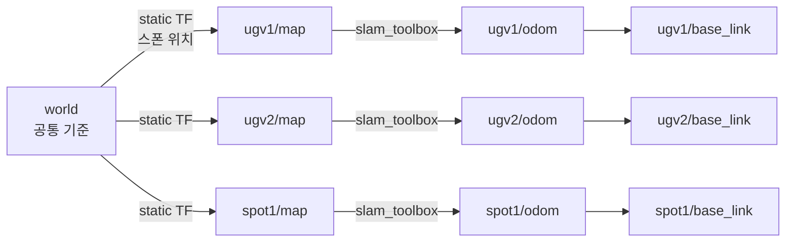
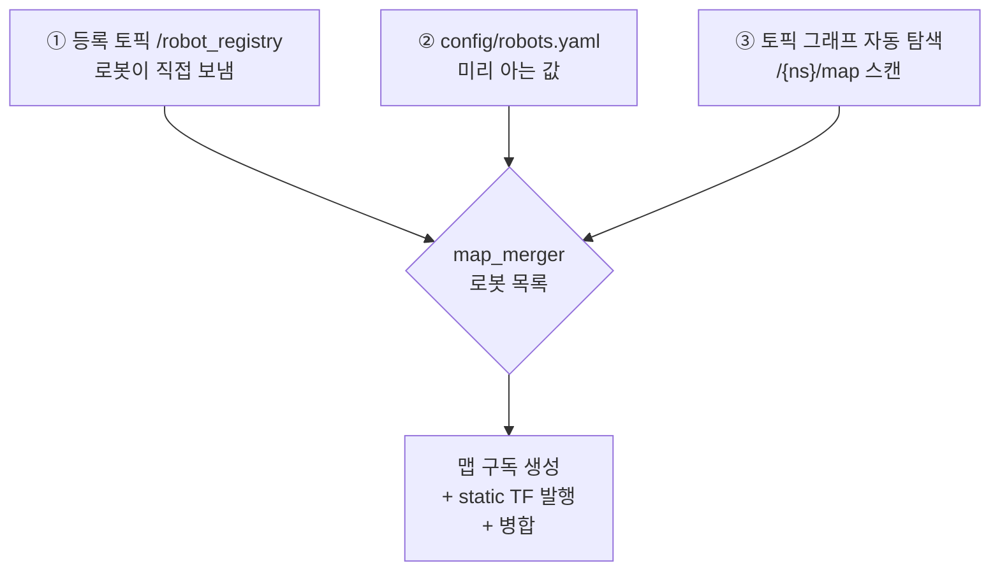

# 맵 병합 (마스터 관제 컨테이너)

로봇마다 따로 만들던 SLAM 맵을 **마스터 관제 컨테이너에서 하나의 전역 맵으로 합치는** 기능.
새 로봇이 나중에 추가돼도 마스터를 건드릴 필요 없이 자동으로 병합에 합류한다.

- 결과 토픽: **`/map_merged`** (`nav_msgs/msg/OccupancyGrid`, frame = `world`)
- 담당 패키지: [src/webots_map_merge/](src/webots_map_merge/)

## 목차
- [1. 왜 필요한가](#1-왜-필요한가)
- [2. 핵심 아이디어 — `world` 앵커 프레임](#2-핵심-아이디어--world-앵커-프레임)
- [3. 왜 오픈소스 대신 직접 짰나](#3-왜-오픈소스-대신-직접-짰나)
- [4. 구성 파일](#4-구성-파일)
- [5. 로봇을 동적으로 받는 3가지 경로](#5-로봇을-동적으로-받는-3가지-경로)
- [6. 병합 알고리즘](#6-병합-알고리즘)
- [7. 실행 방법](#7-실행-방법)
- [8. 새 로봇 추가 절차](#8-새-로봇-추가-절차)
- [9. 검증 결과](#9-검증-결과)
- [10. 주의사항 / 트러블슈팅](#10-주의사항--트러블슈팅)
- [11. 알려진 한계와 다음 단계](#11-알려진-한계와-다음-단계)

---

## 1. 왜 필요한가

지금 구조에서는 로봇마다 slam_toolbox가 **자기만의 맵과 자기만의 좌표계**를 만든다
([Readme 7절](Readme.md#7-로봇-위치-및-맵-데이터) 참고).

| 로봇 | 맵 토픽 | 맵 프레임 |
|---|---|---|
| ugv1 | `/ugv1/map` | `ugv1/map` |
| ugv2 | `/ugv2/map` | `ugv2/map` |
| spot1 | `/spot1/map` | `spot1/map` |

문제는 **`ugv1/map`의 (0,0)과 `ugv2/map`의 (0,0)이 월드에서 서로 완전히 다른 지점**이라는 것.
그래서 지금은

- 관제 화면에서 "전체 현장이 어떻게 생겼는지"를 한 번에 볼 수 없다
- ugv1이 발견한 장애물을 ugv2가 알 방법이 없다
- 웹에서 지도를 클릭할 때 "지금 어느 로봇의 지도를 보고 있는지"를 항상 따져야 한다

맵 병합은 이 세 가지를 한 번에 푼다.

## 2. 핵심 아이디어 — `world` 앵커 프레임

로봇 맵끼리 직접 겹치려 하지 않는다. 대신 **공통 기준 프레임 `world`를 하나 세우고,
각 로봇 맵을 거기에 못 박는다.**



`world → {ns}/map` 변환은 **그 로봇이 Webots에서 스폰된 월드 절대 위치**다.
이 값만 알면 병합은 좌표 변환 + 리샘플링이라는 순수 계산 문제로 줄어든다.

얻는 것:

- **RViz에서 Fixed Frame을 `world`로 두면 모든 로봇이 한 화면에** 제 위치로 나온다 (병합 맵 없이도)
- 로봇 간 좌표 변환이 tf2로 공짜가 된다 (`ugv1/map`의 점 → `world` → `ugv2/map`)
- 웹 목표점도 나중에 `world` 기준 하나로 통일할 수 있다

## 3. 왜 오픈소스 대신 직접 짰나

가장 유명한 선택지는 **`multirobot_map_merge`** (ROS 2 포크: [robo-friends/m-explore-ros2](https://github.com/robo-friends/m-explore-ros2))다.
안 쓴 이유는 하나다.

> 이 패키지의 핵심 가치는 **초기 위치를 모를 때** OpenCV 특징점 매칭(ORB/AKAZE)으로
> 맵끼리 겹쳐 맞춰주는 기능인데, 우리는 Webots 시뮬이라 **스폰 좌표를 이미 정확히 알고 있다.**

즉 이미 풀려 있는 문제를 비싸고 불확실한 방법으로 다시 푸는 셈이다.
게다가 그 패키지의 `known_init_poses`(초기 위치를 아는) 경로는 ROS 2 포크에서 검증이 덜 된 편이라
파라미터 맞추는 삽질 비용이 직접 짜는 비용보다 컸다.

직접 짠 것의 실질 코드량은 **병합 로직 40줄 남짓**이다 ([map_merger.py](src/webots_map_merge/webots_map_merge/map_merger.py)).

> 나중에 실제 로봇으로 넘어가서 초기 위치를 모르게 되면 그때 `multirobot_map_merge`를
> **보정용으로** 얹는 게 맞다. [11절](#11-알려진-한계와-다음-단계) 참고.

## 4. 구성 파일

```
src/webots_map_merge/
├── webots_map_merge/
│   ├── map_merger.py        # 마스터 컨테이너에서 도는 병합 노드
│   └── robot_registrar.py   # 각 로봇 컨테이너에서 도는 "명함 + 하트비트" 노드
├── config/robots.yaml       # 병합 파라미터 + 로봇별 초기 위치
└── launch/master.launch.py  # map_merger + RViz2
```

| 파일 | 어디서 도나 | 하는 일 |
|---|---|---|
| [map_merger.py](src/webots_map_merge/webots_map_merge/map_merger.py) | 마스터 1개 | 로봇 발견 → 맵 구독 → `world` 기준 병합 → `/map_merged` 발행, `world→{ns}/map` static TF 발행 |
| [robot_registrar.py](src/webots_map_merge/webots_map_merge/robot_registrar.py) | 로봇마다 1개 | 1Hz로 `/robot_registry`에 자기 ID·초기 위치·맵 유무를 알림 (하트비트 겸용) |
| [robots.yaml](src/webots_map_merge/config/robots.yaml) | 마스터 | 미리 아는 초기 위치 + 병합 주기/해상도 등 |

## 5. 로봇을 동적으로 받는 3가지 경로

"계속 추가되는 로봇의 맵을 어떻게 받을 것인가"에 대한 답. **세 경로를 겹쳐서** 쓴다.
하나만 쓰면 각각 구멍이 있기 때문이다.



| 경로 | 알 수 있는 것 | 우선순위 | 한계 |
|---|---|---|---|
| ① **등록 토픽** | 로봇 존재 + **초기 위치** + 생존 여부 | 가장 높음 | 로봇 쪽에 `robot_registrar`를 띄워야 함 |
| ② **설정 파일** | 로봇 존재 + 초기 위치 | 중간 | 새 로봇마다 마스터 설정을 고쳐야 함 |
| ③ **자동 탐색** | 로봇 존재만 | 가장 낮음 | 초기 위치를 몰라 원점(0,0,0) 가정 → 맵이 겹쳐 보임 (경고 로그가 찍힘) |

### ① 등록 토픽 — 진짜 "동적"인 부분

로봇 컨테이너가 뜨면 `robot_registrar`가 1Hz로 이런 JSON을 흘린다.

```json
{"robot_id": "ugv3", "init_x": -2.0, "init_y": 4.5, "init_yaw": 1.57,
 "has_map": true, "map_topic": "/ugv3/map"}
```

- QoS가 `TRANSIENT_LOCAL`이라 **마스터가 나중에 떠도 이미 보낸 명함을 받는다.**
  컨테이너 기동 순서를 신경 쓸 필요가 없다.
- 같은 내용을 계속 반복 발행하는 게 **하트비트** 역할을 한다.
  마스터는 15초(`robot_timeout`) 동안 소식이 없으면 그 로봇을 병합에서 뺀다.
  → 컨테이너를 내렸는데 유령 맵이 화면에 남아 있는 일이 없다.
- 초기 위치는 `docker-compose.yml`의 `ROBOT_INIT_X/Y/YAW` 환경변수에서 읽는다.
  기존에 `ROBOT_ID`를 주입하던 방식과 완전히 같은 결이다.

### ③ 자동 탐색 — 안전망

마스터가 0.5Hz로 ROS 토픽 그래프를 훑어 `/{무언가}/map` 패턴 + `OccupancyGrid` 타입을 찾는다.

```python
for topic, types in self.get_topic_names_and_types():
    if 'nav_msgs/msg/OccupancyGrid' not in types:
        continue
    match = self.map_topic_regex.fullmatch(topic)   # ^/([^/]+)/map$
    ...
```

`robot_registrar`를 안 붙인 로봇(예: 지금의 spot1)도 최소한 **존재는 인지**된다.
초기 위치를 모르면 경고를 찍고 원점으로 가정하는데, 이 경우 맵이 겹쳐 보이므로
로그를 보고 `robots.yaml`에 추가하거나 registrar를 붙이면 된다.

## 6. 병합 알고리즘

### 6-1. 경계상자 잡기
활성 로봇들의 맵 네 귀퉁이를 `world`로 변환해 전체를 감싸는 축정렬 사각형을 구하고,
가장자리에 `padding`(기본 1m)을 준다. 이게 병합 격자의 크기가 된다.

로봇이 늘거나 맵이 자라면 이 사각형도 매 주기 자동으로 커진다. 고정 크기 맵이 아니다.

### 6-2. 역방향 매핑으로 샘플링

**병합 격자의 각 셀에서 출발해 "이 위치가 원본 맵의 어느 셀인가"를 거꾸로 찾는다.**

```python
c, s = cos(-theta), sin(-theta)          # theta = 로봇 초기 yaw + 맵 origin yaw
gx = c*(world_x - tx) - s*(world_y - ty) # world -> 격자 로컬 좌표
gy = s*(world_x - tx) + c*(world_y - ty)
col = floor(gx / res); row = floor(gy / res)
```

정방향(원본 셀 → 병합 셀)으로 하면 회전·해상도 차이 때문에 **격자에 구멍이 뚫린다.**
역방향은 모든 병합 셀이 반드시 값을 하나 갖게 되므로 그런 문제가 없다.

전부 numpy 벡터 연산이라 40m×40m / 0.1m 해상도(=16만 셀) × 로봇 4대라도 한 주기가 수십 ms다.

### 6-3. 겹치기 규칙은 `max` 하나

점유 격자 값이 **`-1`(미탐색) < `0`(비어있음) < `100`(장애물)** 순서라서,
크기 비교가 그대로 우선순위가 된다.

```python
np.maximum(merged, sampled, out=merged)
```

- 한 로봇이 미탐색이고 다른 로봇이 봤으면 → **본 쪽을 채택**
- 한 로봇이 비었다고 하고 다른 로봇이 장애물이라 하면 → **장애물 채택** (안전한 쪽)

## 7. 실행 방법

기존과 완전히 동일하다. 마스터 컨테이너의 실행 명령만 바뀌었다.

```bash
docker compose -f docker-configs/windows/docker-compose.yml up --build
```

<details>
<summary>바뀐 부분 (docker-compose.yml)</summary>

```yaml
  master:
    command: >
      bash -c "source /ros2_ws/install/setup.bash &&
               ros2 launch webots_map_merge master.launch.py"   # rviz2 단독 실행에서 변경

  ugv1:
    environment:
      - ROBOT_ID=ugv1
      - ROBOT_INIT_X=-6.159     # 🆕 추가
      - ROBOT_INIT_Y=1.263
      - ROBOT_INIT_YAW=-2.910
```
</details>

### RViz에서 보기
1. **Global Options → Fixed Frame**을 `world`로 변경
2. **Add → By topic → `/map_merged` → Map** 추가

### 확인 명령어
```bash
docker exec -it rviz_master_windows bash
source /ros2_ws/install/setup.bash

ros2 topic hz /map_merged                      # 1Hz로 나와야 정상
ros2 topic echo /map_merged --field info       # 격자 크기/원점/해상도
ros2 topic echo /robot_registry                # 지금 등록된 로봇들
ros2 run tf2_tools view_frames                 # world가 최상위인지 확인
docker logs rviz_master_windows | grep -E "등록|탐색|구독|이탈"
```

## 8. 새 로봇 추가 절차

`ugv3`을 추가한다고 하면:

1. **Webots**: `my_world.wbt`에서 SummitXlSteel 복사 → name을 `ugv3`으로 변경
   ([Readme 4절](Readme.md#4-로봇-추가-방법-향후-자동화-예정))
2. **스폰 좌표 확인**: 복사한 노드의 `translation` x, y와 `rotation`의 각도(yaw)를 적어둔다
3. **docker-compose.yml**에 서비스 추가 — `ugv1` 블록을 복사해서 4줄만 바꾸면 끝

```yaml
  ugv3:
    <<: *ros-common
    container_name: ugv3_brain_windows
    environment:
      - DISPLAY=${DISPLAY:-host.docker.internal:0}
      - RMW_IMPLEMENTATION=rmw_fastrtps_cpp
      - ROS_LOCALHOST_ONLY=0
      - ROS_DOMAIN_ID=30
      - ROBOT_ID=ugv3
      - ROBOT_INIT_X=-2.0
      - ROBOT_INIT_Y=4.5
      - ROBOT_INIT_YAW=1.5708
    command: >
      bash -c "source /ros2_ws/install/setup.bash &&
               ros2 launch webots_python single_ugv.launch.py"
    depends_on:
      - master
```

4. `docker compose up -d ugv3`

**마스터는 건드리지 않는다.** 몇 초 안에 로그에 `[등록] 새 로봇 합류: ugv3`이 찍히고
병합 맵이 알아서 넓어진다. 마스터를 재시작할 필요도 없다.

### yaw 값 구하기
`.wbt`의 `rotation`은 `축x 축y 축z 각도` 형식이다. 로봇이 바닥에 똑바로 서 있으면
축이 대략 `0 0 1`이므로 **마지막 각도 값이 곧 yaw**다.

```
rotation 0.00494 -0.00297 0.99998 -2.910405    ->  init_yaw = -2.910
```

축의 z 성분이 **음수**면 부호를 뒤집는다.

```
rotation 0.1638 -0.0159 -0.98635 0.06476       ->  init_yaw = -0.064  (부호 반전)
```

## 9. 검증 결과

실제 ROS 2 컨테이너에서 가짜 로봇 2대를 띄워 병합 결과를 셀 단위로 검증했다.

| 케이스 | 검사 | 결과 |
|---|---|---|
| 평행이동 (r2를 x+1m) | 두 맵이 정확히 나란히 붙는가, 맵 바깥이 미탐색(-1)인가 | ✅ 5/5 |
| 90° 회전 (r2를 (2,0)에 90° 돌려 배치) | 회전 변환이 맞는가 | ✅ 3/3 |

부수적으로 함께 확인된 것:

- `robots.yaml`의 초기 위치가 정상 로드됨
- 등록 토픽으로 들어온 로봇이 즉시 합류하고 설정값보다 우선함
- **설정에만 있고 실제로 안 뜬 로봇(ugv1/ugv2/spot1)은 병합 격자에 포함되지 않음**
  (격자가 r1/r2만 감싸는 41×31로 나옴)
- `world → r1/map`, `world → r2/map` static TF 발행됨
- `colcon build` 통과, `map_merger` / `robot_registrar` 실행 파일 정상 등록

## 10. 주의사항 / 트러블슈팅

### ⚠️ `/map_merged`가 아예 안 나올 때

**1순위 의심: QoS 미스매치.** slam_toolbox의 `map`은 `TRANSIENT_LOCAL + RELIABLE + depth 1`로 나온다.
기본 QoS로 구독하면 **에러도 경고도 없이 그냥 아무것도 안 들어온다.**
`map_merger.py`의 `map_qos()`가 이걸 맞춰둔 것이고, 직접 디버깅할 때도 맞춰야 한다.

```bash
ros2 topic echo /ugv1/map --qos-durability transient_local --qos-reliability reliable --field info
```

**2순위: `/clock`이 안 돌고 있음.** 병합 노드는 `use_sim_time: true`라서 시뮬레이션 시간으로 돈다.
**Webots가 정지(Pause) 상태면 병합도 멈춘다.** 이건 의도된 동작이다 —
시뮬을 멈춘 동안 로봇이 죽은 것으로 오판하지 않기 위해서다. Webots Play를 눌렀는지 먼저 확인.

### ⚠️ 맵이 서로 겹쳐 보일 때
초기 위치를 모른 채 원점으로 가정했다는 뜻이다. 로그에서 이 경고를 찾는다.

```
[탐색] '/xxx/map' 발견했지만 초기 위치를 모름 -> 원점(0,0,0) 가정.
```

→ `robots.yaml`에 추가하거나 해당 로봇에 `robot_registrar`를 붙인다.

### ⚠️ spot1은 아직 등록 노드가 없다
`single_spot_launch.py`가 **서브모듈**([webots_ros2_spot](https://github.com/seo2730/webots_ros2_spot))에 있어서 건드리지 않았다.
지금은 `robots.yaml`의 값으로 병합된다. 서브모듈에 붙이려면 런치에 이 블록만 추가하면 된다.

```python
Node(
    package='webots_map_merge',
    executable='robot_registrar',
    namespace=ns,
    parameters=[{'robot_id': ns, 'has_map': True, 'map_topic': f'/{ns}/map'}],
)
```

### ⚠️ 병합 맵을 Nav2에 되먹이지 말 것
`/map_merged`는 **관제·시각화·웹 전용**이다. 각 로봇 Nav2는 계속 자기 `{ns}/map`을 쓴다.
되먹이면 프레임 순환과 코스트맵 진동이 생긴다.

### ⚠️ 드론은 병합 대상이 아니다
`drone1`은 아직 거리 센서가 없어 SLAM을 못 돌린다. `has_map: false`로 등록해서
마스터가 존재만 인지하고 맵 구독은 시도하지 않게 했다. 나중에 센서를 달고 SLAM을 붙이면
[single_drone.launch.py](src/webots_python/launch/single_drone.launch.py)의 `has_map`을 `True`로 바꾸기만 하면 된다.

### mac 환경
mac의 master 서비스는 VNC 스크립트(`/start_vnc.sh`)로 뜨는 구조라 자동 변경하지 않았다.
VNC 안에서 `ros2 launch webots_map_merge master.launch.py`를 직접 실행하면 된다.

## 11. 알려진 한계와 다음 단계

### 한계 1 — 시간이 지나면 정렬이 조금씩 틀어진다
초기 위치를 정확히 알아도 **각 로봇의 SLAM은 독립적으로 드리프트**한다.
게다가 `{ns}/map` 원점은 엄밀히는 스폰 지점이 아니라 **첫 스캔 시점의 로봇 위치**라서
처음부터 몇 cm 어긋나 있다. 실내 시뮬 몇 분 수준에서는 눈에 띄지 않지만,
장시간 돌리면 벽이 두 겹으로 보이기 시작한다.

대응은 단계적으로:

| 단계 | 방법 | 비용 |
|---|---|---|
| (a) **지금** | 감수한다 | 0 |
| (b) 다음 | `multirobot_map_merge`의 특징점 매칭을 **보정용으로만** 주기적으로 돌려 static TF를 갱신 | 중 |
| (c) 궁극 | [Swarm-SLAM](https://github.com/lajoiepy/cslam) 등으로 **로봇 간 loop closure**를 걸어 pose-graph 레벨에서 병합 | 높음 |

(c)가 "제대로 된" 다중 로봇 SLAM이고, 실제 로봇으로 넘어가면 결국 그쪽으로 가야 한다.

### 한계 2 — 2D 점유 격자만 다룬다
Spot의 뎁스카메라나 드론 시점처럼 높이 정보가 중요한 경우 2D 격자로는 표현이 안 된다.
필요해지면 `map_merge_3d`(같은 m-explore 계열)나 octomap 쪽을 봐야 한다.

### 한계 3 — 웹 목표점은 아직 로봇별 프레임을 쓴다
지금은 `/web/goal_point`의 `frame_id`가 `{ns}/map`이어야 한다
([Readme 8-1](Readme.md#8-1-맵목표점-데이터-규격-웹-개발자용)).
`world` 프레임이 생겼으니, [web_goal_relay.py](src/webots_goal_bridge/webots_goal_bridge/web_goal_relay.py)가
`world` 기준 좌표를 받아 tf2로 각 로봇 프레임으로 변환하게 바꾸면
**웹은 병합 맵 하나만 그리고 클릭하면 되는** 구조가 된다. 다음에 손대기 좋은 지점.
